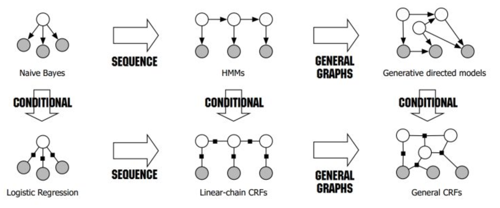
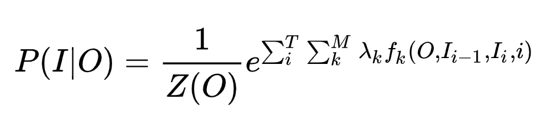
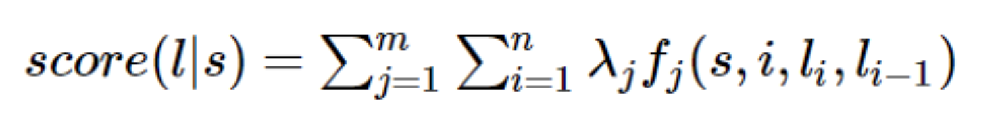
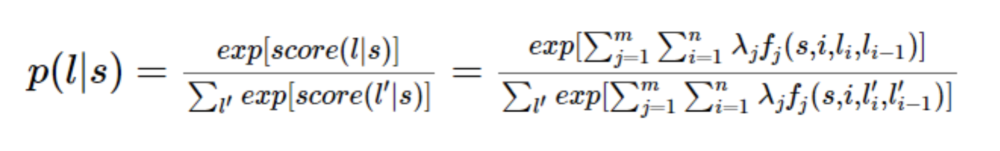

# learn_modeling

一、监督算法：

1.1 分类算法(线性和非线性)

encoder{  
        感知机（神经网络）  
        CNN  
        RNN  
        }

概率{  
        朴素贝叶斯（NB）  
        Logistic Regression（LR）  
        最大熵MEM（与LR同属于对数线性分类模型）  
    }
    
支持向量机(SVM)

决策树(ID3、CART、C4.5)

assembly learning{  
        Boosting{  
            Gradient Boosting{  
                GBDT  
                xgboost（传统GBDT以CART作为基分类器，xgboost还支持线性分类器，这个时候xgboost相当于带L1和L2正则化项的逻辑斯蒂回归（分类问题）或者线性回归（回归问题）；xgboost是Gradient Boosting的一种高效系统实现，并不是一种单一算法。）
            }  
            AdaBoost  
        }     
        Bagging{  
            随机森林  
        }  
        Stacking  
    }  

1.2 概率图模型

假设你有许多小明同学一天内不同时段的照片，从小明提裤子起床到脱裤子睡觉各个时间段都有（小明是照片控！）。现在的任务是对这些照片进行分类。比如有的照片是吃饭，那就给它打上吃饭的标签；有的照片是跑步时拍的，那就打上跑步的标签；有的照片是开会时拍的，那就打上开会的标签。问题来了，你准备怎么干？一个简单直观的办法就是，不管这些照片之间的时间顺序，想办法训练出一个多元分类器。就是用一些打好标签的照片作为训练数据，训练出一个模型，直接根据照片的特征来分类。例如，如果照片是早上6:00拍的，且画面是黑暗的，那就给它打上睡觉的标签;如果照片上有车，那就给它打上开车的标签。这样可行吗？

乍一看可以！但实际上，由于我们忽略了这些照片之间的时间顺序这一重要信息，我们的分类器会有缺陷的。举个例子，假如有一张小明闭着嘴的照片，怎么分类？显然难以直接判断，需要参考闭嘴之前的照片，如果之前的照片显示小明在吃饭，那这个闭嘴的照片很可能是小明在咀嚼食物准备下咽，可以给它打上吃饭的标签；如果之前的照片显示小明在唱歌，那这个闭嘴的照片很可能是小明唱歌瞬间的抓拍，可以给它打上唱歌的标签。所以，为了让我们的分类器能够有更好的表现，在为一张照片分类时，我们必须将与它相邻的照片的标签信息考虑进来。

HMM

HMM是贝叶斯网络，是单向网络。白色的节点是要标记的序列，灰色的节点是观测到的字符序列。HMM模型很漂亮，但是，参数较少，建模和预测能力较弱，假设也太强，只有当前字符和上一个字符才会直接影响当前标记。

MEMM（最大熵马尔科夫）

MEMM能引入多个特征，建模能力相比HMM得到提高，假设也减弱，整个序列上的字符都能直接影响当前标记。MEMM是马尔科夫网络，只是归一化的设计有问题，会导致在预测标记时，更倾向于选择下一个状态更加集中的状态，而这种选择显然是没有道理的，所以，在这种情况下容易发生标记错误。

CRF

CRF是马尔科夫网络，是双向网络（或者说是无向图）。节点相互之间都有影响，两个方向的影响系数可能会有不同。双向网络比单向网络自由度更高，建模能力更强。Linear-chain CRF是不成环的。

对于CRF，白色节点是某个token_i的与label有关的一组特征，可以认为白色节点也是关于多个特征的马尔科夫网络。

这里，我们的特征函数仅仅依靠当前单词的标签和它前面的单词的标签对标注序列进行评判，这样建立的CRF也叫作线性链CRF，这是CRF中的一种简单情况。也就是说，token_i的label只会和token_(i-1)的label以及token_(i+1)的label发生关系，所以是线性的。

CRF的建模公式是：

其中，O是给定的观测序列，比如，一句话的词组成的序列。I是需要做的标记，比如BIO标记。i表示当前关注的token，也就是关注当前label和上一个label的那个token。k表示当前特征，一共M个特征，每个特征执行一定的限定作用。Z(o)是用来归一化的，为什么？想想LR（logistic regression）以及softmax为何有归一化呢，一样的嘛，形成概率值。需要注意的是，这里的归一化是类似softmax的归一化，是全局归一化，对i的求和以及对k的求和一起归一化。

给定一个序列s，有多种标记的方法l。每种l的得分公式就是上面CRF建模公式的分子：

分母用来对多种l序列进行归一化：

    
几个特征函数的例子（此处的标注是词性）:

当l_i是“副词”并且第i个单词以“ly”结尾时，我们就让f1 = 1，其他情况f1为0。不难想到，f1特征函数的权重λ1应当是正的。而且λ1越大，表示我们越倾向于采用那些把以“ly”结尾的单词标注为“副词”的标注序列。f1只和l_i以及s中的一个位置（此处碰巧是第i个位置）有关，与l_(i-1)无关。在crf++中用unigram来表示。

如果i=1，l_i=动词，并且句子s是以“？”结尾时，f2=1，其他情况f2=0。同样，λ2应当是正的，并且λ2越大，表示我们越倾向于采用那些把问句的第一个单词标注为“动词”的标注序列。f2只和l_i以及s中的一个位置(此处是句子的最后一个位置)有关，与l_(i-1)无关。在crf++中用unigram来表示。

当l_i-1是介词，l_i是名词时，f3 = 1，其他情况f3=0。λ3也应当是正的，并且λ3越大，说明我们越认为介词后面应当跟一个名词。f3只和l_i以及l_(i-1)有关。在crf++中用bigram来表示。

如果l_i和l_i-1都是介词，那么f4等于1，其他情况f4=0。这里，我们应当可以想到λ4是负的，并且λ4的绝对值越大，表示我们越不认可介词后面还是介词的标注序列。f4只和l_i以及l_(i-1)有关。在crf++中用bigram来表示。
    
1.3 回归预测

线性回归

神经网络

树回归

Ridge岭回归

Lasso回归

二、非监督：

2.1 聚类

(1) 基础聚类  
    K—means  
    二分k-means   
    K中值聚类  
    GMM聚类  
    
(2) 层次聚类

(3) 密度聚类

(4) 谱聚类

2.2 主题模型

pLSA

LDA隐含狄利克雷分析

2.3 关联分析 (correlation analysis)，对于关联分析，都是x，没有y

Person correlation coefficient

Apriori算法

FP-growth算法    
    
2.4 降维

PCA算法

SVD算法

LDA线性判别分析

LLE局部线性嵌入    

2.5 异常检测

2.6 collaborative filtering (协同过滤)

三、半监督学习：仅有少数种子样本

bootstrapping用于关系抽取

四、迁移学习与复杂的深度学习模型

五、模型的内在机制和物理意义

周志华arxiv论文：learning with interpretable structure from rnn

